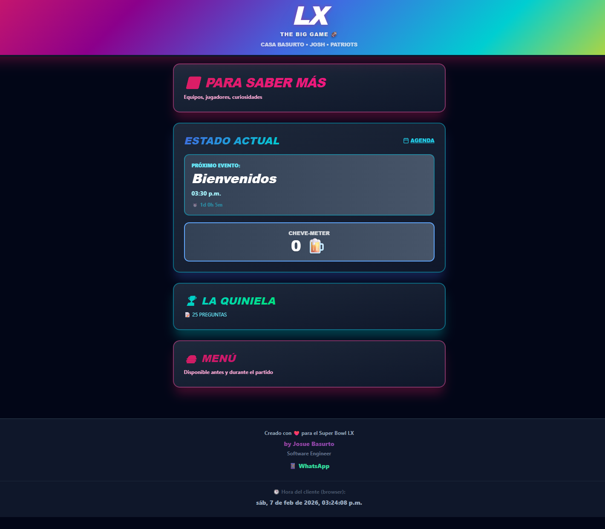

# 🏈 Casa Basurto - Super Bowl LX Hub

Una aplicación web interactiva para disfrutar el Super Bowl LX con amigos. Incluye quiniela de 25 preguntas, menú de comida, agenda del evento, contador de cervezas y más.



## ✨ Funcionalidades

### 🎯 Quiniela Interactiva
- 25 preguntas sobre el partido
- Bloqueo automático después de enviar
- Ver predicciones de todos los participantes
- Tabla de posiciones en tiempo real

### 📅 Agenda del Evento
- Horarios de todos los eventos del día
- Countdown en tiempo real
- Estados visuales (pasado, en curso, futuro)
- Sincronización con hora del cliente

### 🍺 Cheve-Meter
- Contador personal de cervezas
- Indicadores visuales de nivel
- Guardado en localStorage

### 🍔 Menú
- Lista de comida disponible
- Hamburguesas, papas, nachos y más
- Disponible antes y durante el partido

### ℹ️ Información del Partido
- Detalles de equipos (Seahawks vs Patriots)
- Jugadores clave
- Datos curiosos del Super Bowl
- Información del estadio

### ⭐ Encuesta Post-Evento
- 5 preguntas de calidad
- Feedback sobre comida, ambiente y experiencia
- Una respuesta por usuario

### 🎨 Diseño
- Gradientes vibrantes estilo Super Bowl
- Animaciones suaves
- Responsive design
- Tema oscuro

## 🚀 Quickstart

### 1. Clonar el repositorio
```bash
git clone https://github.com/TU_USUARIO/SuperBowlLX.git
cd SuperBowlLX
```

### 2. Instalar dependencias
```bash
npm install
```

### 3. Configurar Supabase

Crea un proyecto en [Supabase](https://supabase.com) y ejecuta el script `database_schema.sql` en el SQL Editor.

### 4. Configurar variables de entorno

Crea un archivo `.env` en la raíz:

```env
VITE_SUPABASE_URL=https://tu-proyecto.supabase.co
VITE_SUPABASE_ANON_KEY=tu-anon-key
```

### 5. Configurar políticas RLS en Supabase

Ejecuta en el SQL Editor:

```sql
ALTER TABLE users ENABLE ROW LEVEL SECURITY;
ALTER TABLE quinielas ENABLE ROW LEVEL SECURITY;
ALTER TABLE orders ENABLE ROW LEVEL SECURITY;
ALTER TABLE stats ENABLE ROW LEVEL SECURITY;
ALTER TABLE surveys ENABLE ROW LEVEL SECURITY;

CREATE POLICY "Allow all" ON users FOR ALL USING (true);
CREATE POLICY "Allow all" ON quinielas FOR ALL USING (true);
CREATE POLICY "Allow all" ON orders FOR ALL USING (true);
CREATE POLICY "Allow all" ON stats FOR ALL USING (true);
CREATE POLICY "Allow all" ON surveys FOR ALL USING (true);
```

### 6. Ejecutar en desarrollo
```bash
npm run dev
```

### 7. Build para producción
```bash
npm run build
```

## 📦 Deploy

### Vercel (Recomendado)
1. Sube el código a GitHub
2. Importa el proyecto en [Vercel](https://vercel.com)
3. Agrega las variables de entorno
4. Deploy automático

### Netlify
1. Sube el código a GitHub
2. Importa el proyecto en [Netlify](https://netlify.com)
3. Build command: `npm run build`
4. Publish directory: `dist`
5. Agrega las variables de entorno

## 🛠️ Stack Tecnológico

- **Frontend**: React 18 + Vite
- **Styling**: Tailwind CSS
- **Database**: Supabase (PostgreSQL)
- **Icons**: Lucide React
- **Hosting**: Vercel / Netlify

## 📁 Estructura del Proyecto

```
SuperBowlLX/
├── src/
│   ├── App.jsx          # Componente principal
│   ├── main.jsx         # Entry point
│   └── index.css        # Estilos globales
├── screenshots/         # Capturas de pantalla
├── database_schema.sql  # Schema de la base de datos
├── .env.example         # Ejemplo de variables de entorno
└── README.md
```

## 🎮 Uso

1. **Registro**: Ingresa tu nombre (único para 7 personas)
2. **Selecciona equipo**: Seahawks o Patriots
3. **Llena la quiniela**: 25 preguntas antes del partido
4. **Disfruta el evento**: Usa el menú, cheve-meter y agenda
5. **Encuesta final**: Comparte tu experiencia

## 📸 Screenshots


## 👨‍💻 Créditos

**Desarrollado por Josue Basurto**
- Software Engineer
- [WhatsApp](https://wa.me/526632954046)

---

Hecho con ❤️ para el Super Bowl LX
